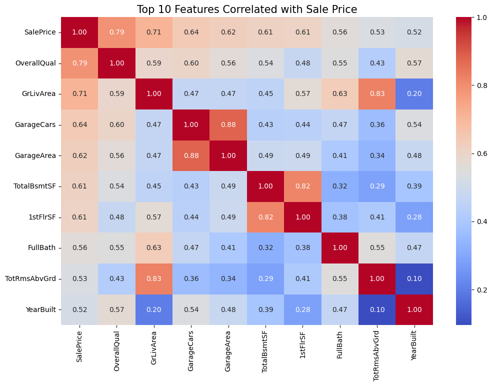
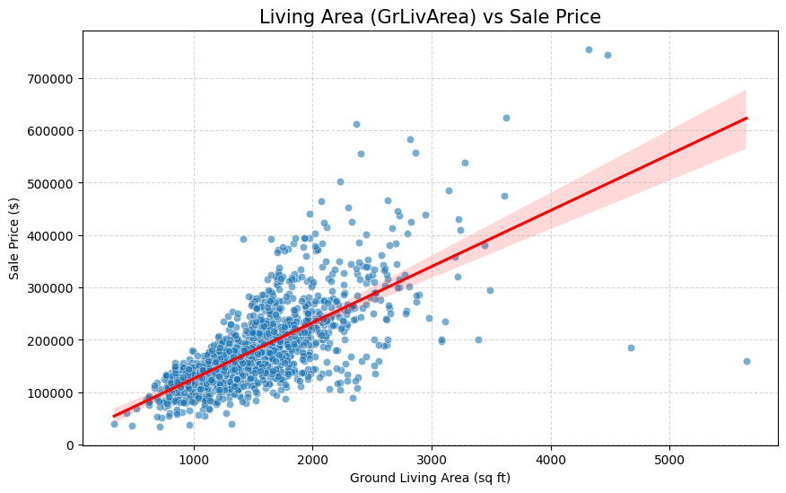
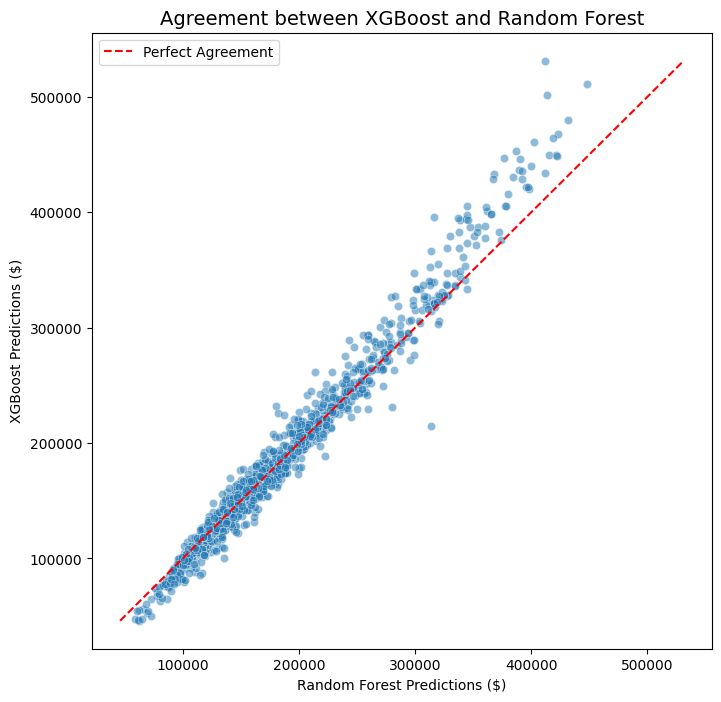

# Housing Price Prediction - Ames, Iowa

## Project Overview
This project aims to predict residential house prices using the **Ames Housing dataset**. The goal was to develop a robust machine learning pipeline, comparing a simple baseline with advanced ensemble methods, and generating final predictions for submission.

## Dataset Details
The **Ames Housing dataset** (compiled by Dean De Cock) is a modern alternative to the classic Boston Housing dataset.
* **Observations:** 2,919 properties (split into training and test sets).
* **Features:** 79 explanatory variables describing almost every aspect of residential homes (e.g., lot size, roof type, neighborhood, and quality ratings).
* **Target Variable:** `SalePrice` (The price the house was sold for).
  
## Exploratory Data Analysis (EDA)
I conducted a visual analysis to understand the key drivers of real estate value:
* **Feature Correlation:** The heatmap identifies `OverallQual` and `GrLivArea` as the most influential variables.
* **Linear Trends:** Scatter plots reveal a strong relationship between surface area and price, while helping to identify potential outliers.

## Methodology & Performance
I implemented and evaluated three models. To measure accuracy, I used the **RMSE (Root Mean Squared Error)** on the validation set:

| Model | Evaluation Metric (RMSE) | Status |
| :--- | :--- | :--- |
| **Linear Regression** | *[Insert your LR score]* | Baseline |
| **Random Forest** | *[Insert your RF score]* | Stable |
| **XGBoost** | **[Insert your XGB score]** | **Top Performer** |

> **Note:** I applied a **Log-Transformation** to the target variable (`SalePrice`) to handle skewness and improve the RMSE score by making the distribution more Gaussian.

## Final Deliverables & Submissions
The project concludes with the generation of three final CSV files containing the estimated prices for the test set:
* `results/submission_lr.csv`
* `results/submission_rf.csv`
* `results/submission_xgb.csv`

## Model Consistency Analysis
Since true test labels are undisclosed, I validated the reliability of my results by analyzing the agreement between models:
* **High Correlation:** The scatter plot below shows strong agreement between **XGBoost** and **Random Forest**, suggesting the models captured real market patterns.
* **Distribution Stability:** I compared the predicted price distributions to ensure no model produced unrealistic outliers (like negative prices).

## Technologies Used
* **Python** (Pandas, NumPy)
* **Machine Learning:** Scikit-Learn, XGBoost
* **Visualization:** Matplotlib, Seaborn

---
*Project developed as part of a personal Data Science portfolio (2025).*
